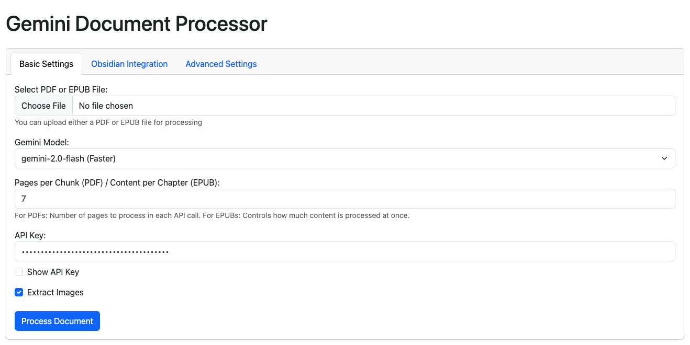

# Gemini Document Processor

A powerful document processing tool that uses Google's Gemini AI to generate high-quality Thai language summaries from PDF and EPUB files, with image extraction and Obsidian integration.



## Features

### Core Functionality
- **AI-Powered Summarization**: Uses Google's latest Gemini models (gemini-2.0-flash, gemini-2.5-flash-preview, gemini-1.5-pro)
- **Multiple Document Formats**: Processes both PDF and EPUB files
- **Thai-Focused Summaries**: Optimized for creating comprehensive Thai language summaries

### Advanced Processing
- **Smart Chunking**: Processes documents in manageable chunks for better AI performance
- **Image Extraction**: Extracts and filters images from documents with size thresholds
- **Robust Error Handling**: Includes intelligent retry mechanisms with model fallbacks
- **Timeout Management**: Configurable timeouts for both API calls and chunk processing

### User Experience
- **Web Interface**: Clean, tabbed web application for document processing
- **Real-time Progress Tracking**: Live updates during processing
- **Job Status Monitoring**: Track failed chunks and retry problematic sections
- **Parallel Processing**: Multi-threaded image extraction for improved performance

### Obsidian Integration
- **Direct Export**: Create markdown files directly in your Obsidian vault
- **Metadata Support**: Includes YAML frontmatter with tags and other metadata
- **Customizable Tags**: Define your own Obsidian tags for processed documents

## Installation

1. Clone this repository:
   ```bash
   git clone https://github.com/yourusername/gemini-document-processor.git
   cd gemini-document-processor
   ```

2. Install the required dependencies:
   ```bash
   pip install -r requirements.txt
   ```

3. Get a Google Gemini API key from [Google AI Studio](https://aistudio.google.com/)

## Usage

### Starting the Web Interface

Run the web server:

```bash
python document_gui.py
```

Then open your web browser and navigate to: http://127.0.0.1:8081/

### Web Interface Features

The interface is organized into three tabs:

1. **Basic Settings**:
   - Upload PDF or EPUB files
   - Select Gemini model:
     - gemini-2.0-flash (Faster)
     - gemini-2.5-flash-preview (More accurate)
     - gemini-1.5-pro (Backup option)
   - Adjust chunk size (pages per processing unit)
   - Enter your Gemini API key
   - Toggle image extraction

2. **Obsidian Integration**:
   - Enable automatic export to Obsidian
   - Verify and set Obsidian vault path
   - Configure tags, author, cover URL, and review ratings
   - Automatic path validation

3. **Advanced Settings**:
   - Configure timeout settings:
     - Chunk processing timeout (60-1800 seconds)
     - API request timeout (30-300 seconds)
   - Set retry attempts for API calls
   - Configure image size thresholds
   - Select image format (PNG/JPG)
   - Adjust worker thread count (1-16)

### Job Status and Monitoring

- **Real-time Progress**: View detailed progress during processing
- **Log Viewer**: See all processing events as they happen
- **Failed Chunks**: Identify and retry problematic sections
- **Result Management**: Download or view generated summaries
- **Obsidian Export**: Track files exported to your Obsidian vault

## How It Works

1. **Document Loading**: The application loads PDF or EPUB files and extracts text content
2. **Chunking**: Content is divided into manageable chunks (by page for PDFs, by chapter for EPUBs)
3. **Image Extraction**: Images are extracted with size filtering and saved separately
4. **AI Processing**: Each chunk is sent to Gemini API with timeout handling and retries
5. **Error Recovery**: Failed chunks are tracked and can be retried with more robust settings
6. **Summary Creation**: Results are compiled into a well-formatted Markdown document
7. **Integration**: Summary and images are saved locally and (optionally) to Obsidian

## Troubleshooting

### Common Issues

- **API Errors**: Check your API key and internet connection
- **Processing Timeouts**: Increase the chunk and API timeout values in Advanced Settings
- **Failed Chunks**: Use the "Retry Failed Chunks" button on the job status page
- **Obsidian Integration**: Ensure your Obsidian vault path is correct and contains a .obsidian folder

### Error Logs

For detailed error information, check the application logs in your terminal or command prompt.

## Project Structure

- `document_gui.py` - Web interface and job management
- `document_processor.py` - Core processing logic for documents
- `epub_processor.py` - EPUB-specific processing functionality
- `templates/` - HTML templates for web interface
- `uploads/` - Temporary storage for uploaded files and processing results

## License

This project is licensed under the MIT License - see the [LICENSE](LICENSE) file for details.

## Credits

This project uses the following technologies:
- [Google Generative AI API](https://ai.google.dev/)
- [Flask](https://flask.palletsprojects.com/)
- [PyPDF](https://pypdf.readthedocs.io/en/latest/)
- [ebooklib](https://github.com/aerkalov/ebooklib)
- [Bootstrap](https://getbootstrap.com/) for the web interface